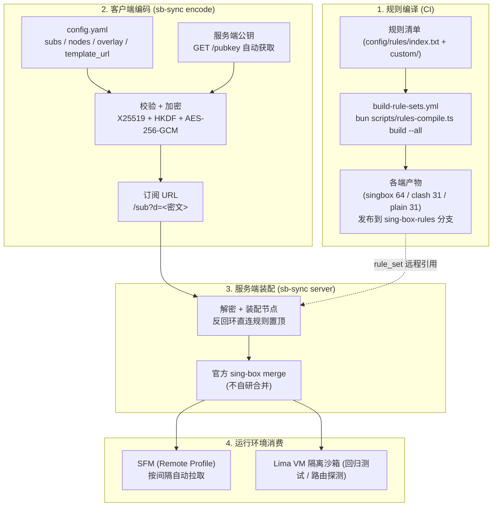
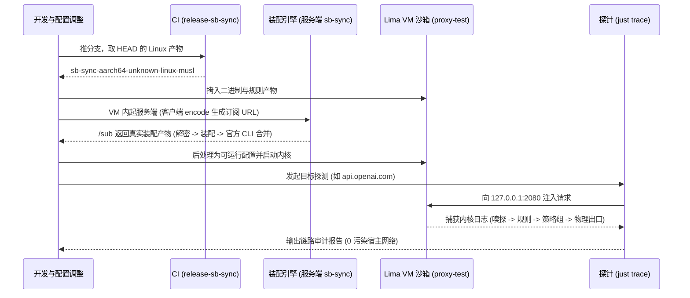

# 项目系统架构 (ARCH)

## 1. 仓库整体结构

```text
proxy/
├── scripts/
│   └── sb-sync-rs/       # sb-sync 客户端编码 + 服务端装配（Rust 单二进制）
├── config/
│   ├── rules/            # 分流规则源 (自定义 .list 与上游 index.txt)
│   ├── sing-box/         # sing-box 生产底模 (template.json) 与沙箱测试套件
│   └── loon/             # Loon 配置与自动化插件 (plugins/)
├── docs/                 # 架构 (ARCH / sb-sync) 与用户指南
├── .github/workflows/    # CI：ci-sb-sync 门禁；tag v* 触发二进制与镜像发布
├── Dockerfile            # 服务端镜像（sing-box CLI + sb-sync）
└── justfile              # 统一测试与运维指令入口
```

## 2. 链路一：配置交付链路 (Config Delivery Pipeline)



要点：

- **规则产物自动重建**：改 `index.txt` / `custom/**` / `template.json` 触发 CI 编译并发布，无需手工往 `sing-box-rules` 分支提交
- **清单与底模强一致**：CI 校验每个 tag 的 policy 与底模 `route.rules` 的去向一致，漂移即失败（底模是手写单一配置源，编译器只报错不改写）
- **凭据零外泄**：订阅与节点只经服务端公钥加密后传输，私钥不出服务端，公钥可公开
- **合并交给官方 CLI**：服务端不实现合并算法，输入文件按 `00-direct` / `01-overlay` / `02-base` 命名，路径字典序决定优先级（标量取先者、数组按序拼接）
- **不耦合仓库目录**：底模用编译期内嵌版，或由客户端 `template_url` 指定；服务端无状态
- 细节见 [sb-sync 架构](./sb-sync.md)

## 3. 链路二：运行时流量决策链路 (Runtime Traffic Pipeline)

```mermaid
flowchart LR
    IN["流量入站\n(TUN / Mixed 2080)"] --> SNIFF["协议嗅探\n(Host / SNI)"]

    SNIFF --> ROUTE{"路由裁决矩阵\n(route.rules)"}

    ROUTE -->|内网域名| OUT_DIR["直连 (direct)"]
    ROUTE -->|广告 / 隐私| OUT_REJ["阻断 (reject)"]
    ROUTE -->|OpenAI / Gemini / Dev 等| GROUP["分流策略组\n(Selectors)"]
    ROUTE -->|未命中 (兜底)| GROUP_PROXY["默认代理 (proxy)"]

    GROUP --> LEAF{"候选池决策"}
    GROUP_PROXY --> LEAF

    LEAF -->|Index 0 (首选)| N_SELF["自建节点 (SelfHost)"]
    LEAF -->|Index 1..N (备选)| N_AIRPORT["机场专线节点"]
```

## 4. 链路三：沙箱仿真与验证闭环 (Verification Loop)



## 5. 发布与门禁链路

发布操作规范见根目录 `RELEASE.md`。版本真源是 `scripts/sb-sync-rs/Cargo.toml`，由 release-plz 的 Release PR 一并更新（含根 `Cargo.lock` 与 `CHANGELOG.md`）。

仓库根 `Cargo.toml` 是 workspace 清单（不含版本），必须留在根：release-plz 的 `git_only` 模式在清单所在目录打开 Git 仓库且不向上层搜索 `.git`，放回 crate 子目录会让版本推导直接失败。cargo 的 `target/` 同样属于 workspace 根。

```text
每次改动 (scripts/sb-sync-rs/**、根 Cargo.toml/Cargo.lock 或 template.json) → ci-sb-sync.yml
  → cargo fmt --check → cargo clippy（严格规则在 crate 属性中声明）
  → mise 装 .mise.toml 里的 sing-box → cargo test → cargo build --release
  → cargo build --release → docker build（--build-arg 内核版本，不推送）
    + 起容器验 /healthz 与 /pubkey

合并 Release PR → main 的清单版本变化被 release-sb-sync.yml 检测到
  → prepare 校验 tag ↔ 清单 ↔ 锁文件，创建 tag（GITHUB_TOKEN，同一次 run 内）
  三平台各自在原生 runner 上 cargo test --release → cargo build --release
    aarch64-apple-darwin      (macos-15)          客户端
    aarch64-unknown-linux-musl (ubuntu-24.04-arm) 沙箱 VM 与 arm64 节点
    x86_64-unknown-linux-musl  (ubuntu-latest)    amd64 节点
  → 每个产物在构建机上原生跑 version 冒烟并断言等于清单版本；Linux 断言静态链接
  → 每平台取本架构二进制就地 load 起容器冒烟，再按 digest 推送镜像
  → imagetools create 合并为 manifest list（断言恰为 arm64 + amd64）
  → 三份二进制 + SHA256SUMS 上传 GitHub Release（说明取 CHANGELOG 段）
  → mise [tools."github:shelken/proxy"] 按 v<semver> 拉取 darwin 产物
```

触发点是 `push: main` 而非 tag：用 `GITHUB_TOKEN` 创建 tag 不会触发 `on.push.tags` 的工作流（要绕开只能引入 PAT），所以 tag 被降级为同一次 run 内的产物。是否已发布只看 GitHub Release 是否存在——构建失败留下的 tag 会被复用，版本不会卡死。

构建期不改写任何文件：版本由 Release PR 提交，CI 只校验。原实现的 `sed` 改 `Cargo.toml` 却不改 `Cargo.lock`，与后续 `--locked` 冲突，三个平台会同时失败（见 `postmortems/004`）。

`workflow_dispatch` 会跑完同一条镜像链路，但只推到 `snapshot-<sha>` 一次性 tag：
多架构 manifest 合并只在发版时第一次执行的话，digest 拼接与 GHCR 权限都验不到。
包是公开包，GHCR 对公开包不计量存储，这些快照无需回收。
