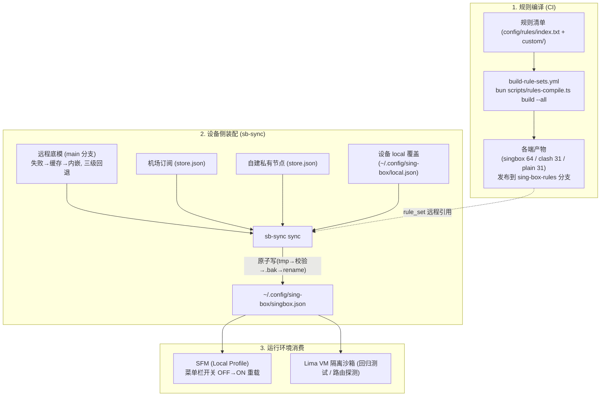
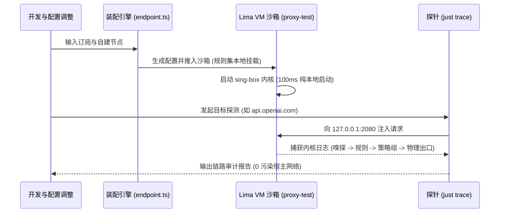

# 项目系统架构 (ARCH)

## 1. 仓库整体结构

```text
proxy/
├── scripts/
│   └── sb-sync-rs/       # sb-sync 设备侧同步 CLI（Rust 单二进制）
├── config/
│   ├── rules/            # 分流规则源 (自定义 .list 与上游 index.txt)
│   ├── sing-box/         # sing-box 生产底模 (template.json) 与沙箱测试套件
│   └── loon/             # Loon 配置与自动化插件 (plugins/)
├── .github/workflows/    # CI：tag v* 触发 sb-sync 编译发布
└── justfile              # 统一测试与运维指令入口
```

## 2. 链路一：设备侧配置交付链路 (Device Config Pipeline)



要点：

- **规则产物自动重建**：改 `index.txt` / `custom/**` / `template.json` 触发 CI 编译并发布，无需手工往 `sing-box-rules` 分支提交
- **清单与底模强一致**：CI 校验每个 tag 的 policy 与底模 `route.rules` 的去向一致，漂移即失败（底模是手写单一配置源，编译器只报错不改写）
- **装配全部本地化**：订阅抓取、URI 解析、策略组填充都在设备上完成，凭据零外泄
- **内核校验是可选依赖**：`SING_BOX` 环境变量 → PATH 上的 sing-box → SFM 面板在线探测 → 全无则跳过（`.bak` 回滚保底）
- **不耦合仓库目录**：底模来自远程 main 分支或二进制内嵌版，产物与状态在 `~/.config/sing-box/`

## 3. 链路二：运行时流量决策链路 (Runtime Traffic Pipeline)

```mermaid
flowchart LR
    IN["流量入站\n(TUN / Mixed 2080)"] --> SNIFF["协议嗅探\n(Host / SNI)"]

    SNIFF --> ROUTE{"路由裁决矩阵\n(route.rules)"}

    ROUTE -->|内网域名| OUT_DIR["直连 (direct)"]
    ROUTE -->|广告 / 隐私| OUT_REJ["阻断 (reject)"]
    ROUTE -->|OpenAI / Gemini / Dev 等| GROUP["分流策略组\n(Selectors)"]
    ROUTE -->|未命中 (兜底)| GROUP_PROXY["默认代理 (proxy)"]

    GROUP --> LEAF{"候选池决策"}
    GROUP_PROXY --> LEAF

    LEAF -->|Index 0 (首选)| N_SELF["自建节点 (SelfHost)"]
    LEAF -->|Index 1..N (备选)| N_AIRPORT["机场专线节点"]
```

## 4. 链路三：沙箱仿真与验证闭环 (Verification Loop)



## 5. 发布链路

```text
git tag v* → GitHub Actions (release-sb-sync.yml)
  → cargo test --release → cargo build --release
  → 上传 sb-sync-aarch64-apple-darwin 到 GitHub Release
  → mise [tools."github:shelken/proxy"] 按 v<semver> 拉取
```
