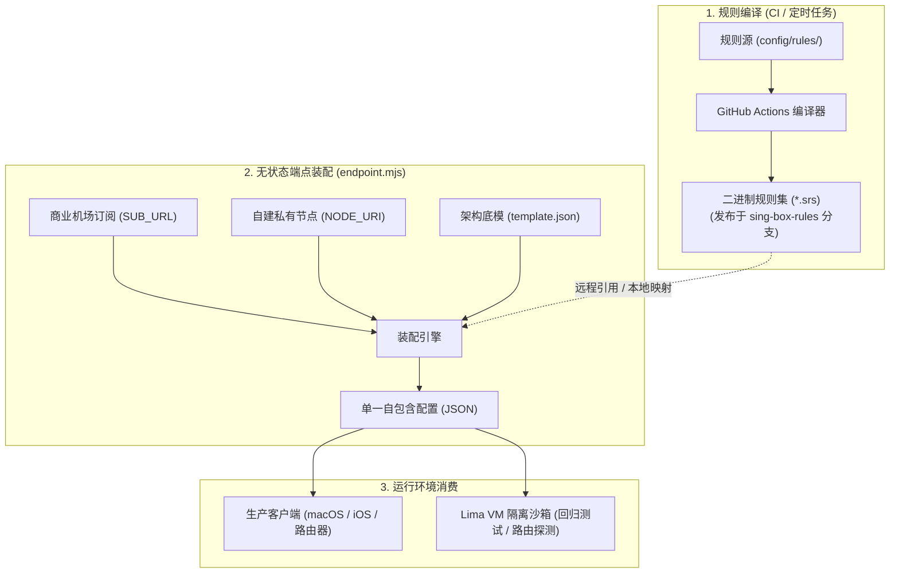
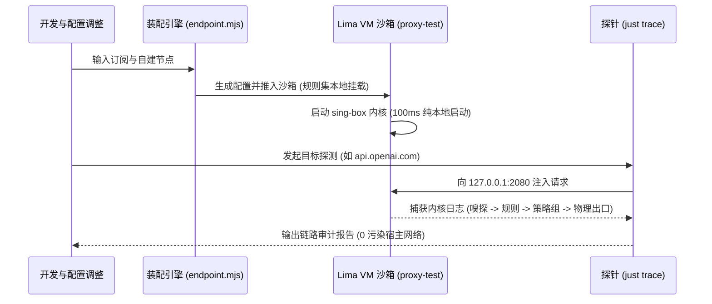

# 项目系统架构 (ARCH)

## 1. 仓库整体结构

```text
proxy/
├── config/
│   ├── rules/            # 分流规则源 (自定义 .list 与上游 index.txt)
│   ├── sing-box/         # sing-box 生产底模 (template.json) 与沙箱测试套件
│   └── loon/             # Loon 配置与自动化插件 (plugins/)
├── scripts/
│   ├── endpoint.mjs      # 单 URL 无状态配置装配引擎
│   └── trace-route.mjs   # 沙箱全链路路由诊断探针
├── .github/workflows/    # CI 自动化构建 (规则集离线编译为 .srs)
└── justfile              # 统一测试与运维指令入口
```

---

## 2. 链路一：配置与规则交付链路 (Asset & Config Pipeline)



---

## 3. 链路二：运行时流量决策链路 (Runtime Traffic Pipeline)

```mermaid
flowchart LR
    IN["流量入站\n(TUN tun0 / Mixed 2080)"] --> SNIFF["协议嗅探\n(Host / SNI)"]
    
    SNIFF --> ROUTE{"路由裁决矩阵\n(route.rules)"}

    ROUTE -->|内网域名| OUT_DIR["直连 (direct)"]
    ROUTE -->|广告 / 隐私| OUT_REJ["阻断 (reject)"]
    ROUTE -->|OpenAI / Gemini / Dev 等| GROUP["分流策略组\n(Selectors)"]
    ROUTE -->|未命中 (兜底)| GROUP_PROXY["默认代理 (proxy)"]

    GROUP --> LEAF{"候选池决策"}
    GROUP_PROXY --> LEAF

    LEAF -->|Index 0 (首选)| N_SELF["自建节点 (SelfHost)"]
    LEAF -->|Index 1..N (备选)| N_AIRPORT["机场专线节点"]
```

---

## 4. 链路三：沙箱仿真与验证闭环 (Verification Loop)


