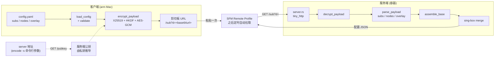
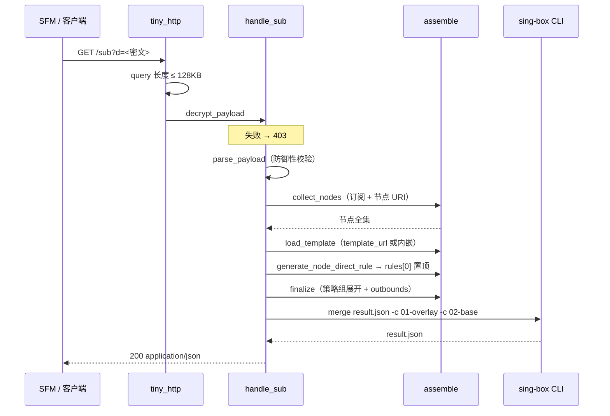
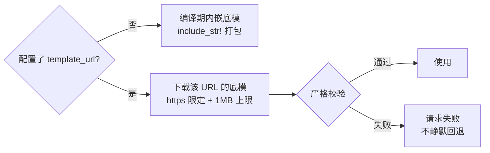
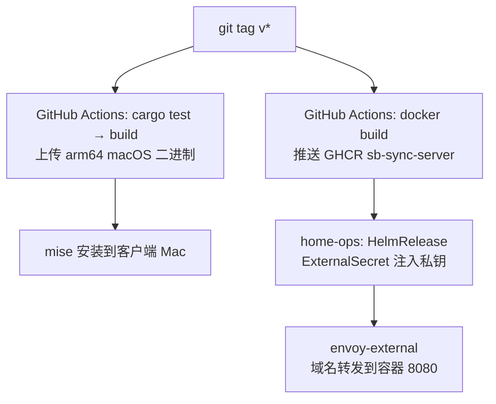

# sb-sync 架构

客户端加密编码 + 服务端原生合并的双形态单二进制。客户端只持有服务端公钥，服务端只持有自身私钥，订阅凭据全程不经第三方

## 1. 为什么是双形态

旧交付链路（客户端直写 SFM Group Container 的 `settings.db` 与 profile 文件）被 macOS 跨沙盒权限阻断，且无合法修复通道。现改走 SFM 官方 Remote Profile 订阅机制：客户端产出的是**一条加密 URL**，服务端产出的是**标准 sing-box 配置 JSON**

| | 客户端 | 服务端 |
| :--- | :--- | :--- |
| 子命令 | `encode`、`keygen` | `server` |
| 运行位置 | 任意 arm Mac（mise 安装） | 容器（home-ops） |
| 输入 | 本机 YAML 配置 | 加密 URL 查询参数 |
| 输出 | 剪切板订阅 URL | sing-box 配置 JSON |
| 持有密钥 | 服务端**公**钥 | 服务端**私**钥 |
| 网络行为 | 无 | 拉订阅 + 拉底模 + 调 CLI |

## 2. 端到端链路



客户端与服务端之间只有一条 URL，无凭证交换、无长连接、无会话状态。公钥非机密，经 `/pubkey` 明文传输即可，省掉手工同步密钥材料这一步

## 3. 客户端

```text
sb-sync encode -s <server> [-c <config.yaml>]   # 取公钥 → 校验 YAML → 加密 → 写剪切板
sb-sync keygen                               # 生成服务端 X25519 密钥对（部署时一次）
```

`encode` 流程

```text
cmd_encode
  config::normalize_server           # 校验 http(s):// 并去尾斜杠
  paths::client_config_path          # 默认 ~/.config/sing-box/config.yaml
  config::load_config                # serde_yaml，deny_unknown_fields
  config::fetch_server_public_key    # GET {server}/pubkey，拉取后立即校验 Hex
  config::encode_payload
    config::validate                 # 字段合法性与 overlay 安全审查
    crypto::encrypt_payload
  config::build_url                  # {server}/sub?d={ciphertext}
  pbcopy                             # 非 macOS 失败不阻断，仅打印提示
```

服务端地址是**命令行参数**，不写进 YAML：同一份配置可以指向不同服务端，切换只改命令。公钥每次从服务端 `/pubkey` 实时拉取并由私钥推导，因此没有任何需要手工同步的密钥材料

## 4. 加密协议

ECIES（X25519 + HKDF-SHA256 + AES-256-GCM），每次 `encode` 都用新的临时密钥对，同一份配置两次编码得到不同密文

```text
密文报文（Base64URL 无填充）
┌──────────────┬───────────┬────────────────────┐
│ 32B 临时公钥  │ 12B Nonce │ 密文 + 16B GCM Tag │
└──────────────┴───────────┴────────────────────┘

派生：HKDF-SHA256(salt="sb-sync-v1", info="aes-256-gcm", ikm=DH(eph_sk, server_pk))
```

服务端解密失败一律 403，且日志不回显密文。协议常量在 `scripts/sb-sync-rs/src/crypto.rs` 顶部

## 5. 服务端



路由表

| 方法 | 路径 | 语义 |
| :--- | :--- | :--- |
| GET | `/healthz` | 200 `ok`，供容器探针 |
| GET | `/pubkey` | 200，私钥推导出的 X25519 公钥（64 字符 Hex），供客户端 `encode` 自动获取 |
| GET | `/sub?d=` | 解密 → 装配 → 合并 → 配置 JSON |
| GET | `/sub`（无 d） | 400 |
| 其他 | 任意 | 404 |

错误码

| 码 | 触发 |
| :--- | :--- |
| 403 | 密文 Base64URL 非法、长度不足、GCM 校验失败（错误公钥加密或篡改） |
| 400 | 缺少 `d`、超查询长度上限、载荷结构非法、订阅抓取失败、CLI 合并失败 |
| 404 | 未匹配的路径或非 GET 方法 |

日志只输出方法与路径，**不含 query string**，因此密文与明文都不落盘

```text
[sb-sync server] GET /sub -> 200 (1258ms, 底模: remote)
```

### 反回环直连规则

节点服务器的 IP 若被二次代理会形成回环。规则在节点全集确定后生成，并插入 `route.rules[0]` 保证最先命中

```text
IP server      → ip_cidr（v4 /32、v6 /128）
域名 server    → domain 列表 + 尽力解析 IPv4 → ip_cidr
解析顺序       → 系统 getaddrinfo → AliDNS DoH（https://223.5.5.5/resolve）→ 只留 domain 规则
```

服务端无 TUN 劫持，不需要 fakeip 排除

### 实例复用

服务端直接复用客户端的装配管线（`collect_nodes` / `finalize` / `populate_selectors`），因此「节点标签分配、策略组展开、空组跳过」在两个形态下语义一致。策略组匹配不到节点时整组跳过并告警，避免 sing-box `missing tags` 致命错误

## 6. 合并机制

服务端不自研合并算法，直接调用官方 CLI。两份输入文件的**文件名前缀是承重设计**，不是随手命名

```text
01-overlay.json   客户端提交的 overlay
02-base.json      服务端装配好的底模（含节点、策略组、反回环规则）
```

实测（sing-box 1.14.1）：生效顺序由**文件路径字典序**决定，与 `-c` 的 argv 顺序无关，靠后者覆盖同类标量

| 类型 | 行为 | 结果 |
| :--- | :--- | :--- |
| 标量（`log.level`、`dns.strategy`、`route.final`） | 后排序者胜 | `02-base` 胜，底模结构值权威，overlay 改不坏骨架 |
| 数组（`route.rules`） | 拼接，非覆盖 | `01-overlay` 的元素排最前，overlay 路由规则优先命中 |

复现

```bash
# 见 scripts/sb-sync-rs/src/server.rs::run_singbox_merge 的写入与调用顺序
mise exec -- sing-box merge --help
```

`sing-box` 版本固定在容器镜像里。升版本必须重跑合并语义验证，因为该行为随实现变化

## 7. 配置文件

### 7.1 客户端 `config.yaml`

默认路径 `~/.config/sing-box/config.yaml`，可用 `-c` 指定。未知顶层字段直接拒绝，防止拼错字段被静默忽略。服务端地址不在配置中，它是 `encode` 的命令行参数

| 字段 | 必填 | 说明 |
| :--- | :--- | :--- |
| `subs` | 二选一 | 机场订阅 URL 列表，逐项须 `http(s)://` |
| `nodes` | 二选一 | 私有节点 URI 列表，支持 `ss` / `hysteria2` / `hy2` / `anytls` |
| `overlay` | 否 | 原生 sing-box JSON 文本，须为 Object |
| `template_url` | 否 | 远程底模 URL，仅 `https`，配置后替代内嵌底模 |

`subs` 与 `nodes` 至少一个非空

```yaml
subs:
  - https://airport.example/api/v1/client/subscribe?token=...
nodes:
  - hy2://password@host:8388/?sni=example.com#selfhost
template_url: https://raw.githubusercontent.com/shelken/proxy/main/config/sing-box/template.json
overlay: |
  {
    "log": { "level": "warn" },
    "dns": { "strategy": "prefer_ipv6" }
  }
```

```bash
sb-sync encode -s https://sub.example.com
```

### 7.2 overlay 的安全边界

密钥永不出本机，但 overlay 会送到服务端并在那里被 CLI 解析。sing-box 的 `merge` 会**读取服务器本地文件并内联进结果**，因此以下字段在客户端就被拒绝（含 ECH 等嵌套位置）

```text
certificate_path
key_path
private_key_path
config_path
```

需要证书时改为内联内容（如 `certificate`）。实现见 `scripts/sb-sync-rs/src/config.rs::reject_path_fields`

### 7.3 服务端环境变量

| 变量 | 必填 | 说明 |
| :--- | :--- | :--- |
| `SERVER_PRIVATE_KEY` | 是 | 32 字节 Hex，缺失则启动即失败 |
| `PORT` | 否 | 缺省 8080，可被 `--port` 覆盖 |

### 7.4 底模来源



不给 URL 时用内嵌底模，这是默认路径。配置了 `template_url` 就改用下载的底模，此时失败**不会**回退到内嵌版：用户显式指定了底模，静默换成另一份会让节点与策略组对不上，比直接报错更难排查

下载内容的校验（`template.rs::fetch_template`）：

| 校验 | 原因 |
| :--- | :--- |
| 仅 `https` | 明文传输的底模可被中间人替换 |
| 拒绝内网 IP 字面量（含 `169.254.169.254` 云元数据端点） | 载荷公钥经 `/pubkey` 公开，任何能访问 `/sub` 的人都能指定 URL，不设限等于把服务端当 SSRF 跳板 |
| 响应 ≤ 1MB | 挡超大响应 |
| 必须是合法 JSON 且顶层为 Object | 恶意或损坏内容不得进入装配 |
| 无 `certificate_path` 等路径字段 | 底模同样进 `sing-box merge`，会内联服务器文件 |

前三条在客户端 `encode` 阶段也会先跑一遍，配置写错时本地立刻报错，不浪费一次网络往返

## 8. 部署



镜像多阶段构建：上游 sing-box 镜像提供 CLI，Rust 阶段编译静态二进制，运行阶段只装 `ca-certificates` 与 `tzdata`

```text
Dockerfile                     三阶段构建
.github/workflows/             tag 触发的二进制与镜像双发布
```

大坑：`include_str!` 的基准是源文件所在目录，`src/../../../config/...` 三级上跳后落在容器**根**，所以 `COPY` 目标必须是 `/config/sing-box/template.json`，放 `/build/config/` 会编译失败

## 9. 已知遗留

- `assemble.rs` 的 `merge_local_config` 与 `AssembleInput.local` 在生产路径已无调用者（客户端 local 覆盖改由 `overlay` 承担），仅测试引用
- `libc` 依赖在 `main.rs` 重写后已无使用点
- `scripts/endpoint.ts` 与 `scripts/trace-route.ts` 是沙箱测试用的 TS 装配实现，与 Rust 版并行维护，两者的策略组语义必须同步

## 10. 关键文件

| 文件 | 职责 |
| :--- | :--- |
| `scripts/sb-sync-rs/src/main.rs` | CLI 入口与三个子命令分派 |
| `scripts/sb-sync-rs/src/config.rs` | YAML 结构、校验、overlay 安全审查、公钥拉取、URL 组装 |
| `scripts/sb-sync-rs/src/crypto.rs` | X25519 + HKDF + AES-GCM 加解密，私钥推导公钥 |
| `scripts/sb-sync-rs/src/server.rs` | HTTP 路由、载荷解析、CLI 合并调用、临时目录 RAII |
| `scripts/sb-sync-rs/src/assemble.rs` | 节点解析、策略组展开、反回环规则生成 |
| `scripts/sb-sync-rs/src/template.rs` | 底模来源（内嵌或 template_url 下载）、URL 安全校验、HTTP GET |
| `scripts/sb-sync-rs/src/node.rs` | 节点 URI 解析（ss / hysteria2 / anytls） |
| `config/sing-box/template.json` | 生产底模（策略组与路由骨架） |
